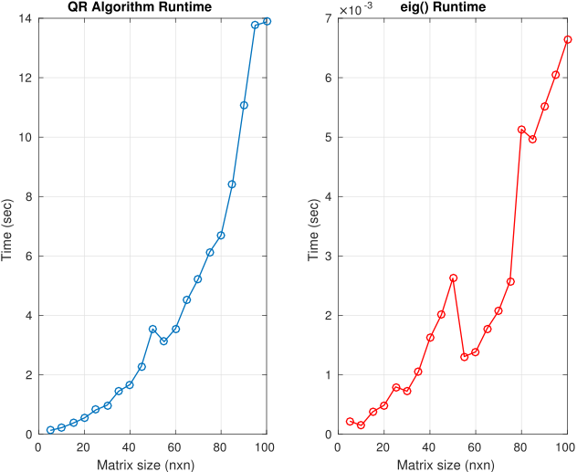
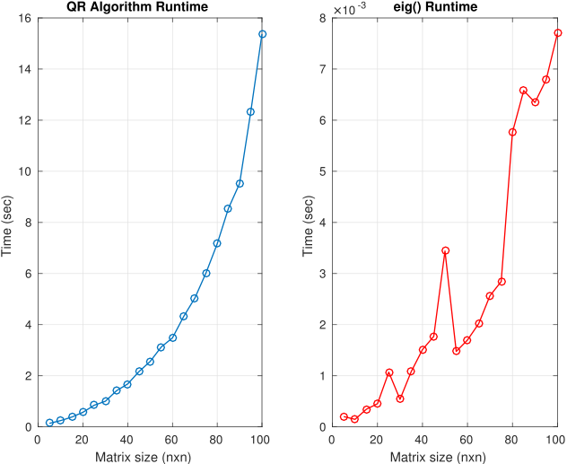

\begin{center}
\vspace*{30mm}
{\fontsize{50}{60}\selectfont Közelítő és szimbolikus \\
\vspace{5mm}
 számítások haladóknak}

\vspace{15mm}

{\fontsize{25}{30}\selectfont - Esszé -}

\vspace{10mm}

{\fontsize{24}{24}\selectfont \textbf{QR algoritmus sajátértékek megkeresésére \\
\vspace{3mm}
Householder transzformációkkal}}

\vspace{15mm}
{\fontsize{20}{30}\selectfont Krizsák Tibor \\}
\vspace{5mm}
{\fontsize{20}{30}\selectfont KRTTABT.SZE}
\end{center}

\newpage

# A problémáról

A feladat az, hogy egy adott $A$ négyzetes ($n \times n$-es) mátrixhoz írjunk olyan függvényt, amely megkeresi a mátrix sajátértékeit.

**Definíció.** *Legyen $A$ tetszőleges mátrix. A $\lambda \in C$ számot az $A$ **sajátértékének** hívjuk, ha létezik olyan $v \in C^n, v \neq 0$ vektor, amellyel*
$$Av = \lambda v.$$
*Ekkor $v$-t a $\lambda$-hoz tartozó sajátvektornak mondjuk.*

A sajátértékek kiszámításához ebben az esetben a **QR algoritmust** használjuk.

Ehhez az $A$ mátrixot $A = QR$ formára kell bontanunk, ahol $Q$ ortogonális, $R$ pedig felső-trianguláris mátrixok. Az ezt megvalósító eljárást *ortogonális triangularizációnak* nevezzük.
A módszer során elemi mátrix műveleteket végzünk, amelyek mindegyike egy $\mathbb{R}^n$-beli hipersíkra való tükrözés, amelynek során az $A$ mátrixot felső trianguláris formára hozzuk (ez lesz az $R$ mátrix, viszont a $Q$-t is megkapjuk).

**Definíció.** *A $H \in \mathbb{R}^{n \times n}$ mátrixot **elemi tükröző mátrixnak** (vagy **Householder mátrixnak**) nevezzük, ha felírható*
$$H = I - \frac{2}{h^T h}hh^T$$
*alakban valamely $h \neq 0$ vektorral.*

Így már minden adott az $A$ mátrix felbontásához.

**3.11. Tétel.** *Tetszőleges $A \in \mathbb{R}^{n \times n}$ mátrix ortogonális-trianguláris felbontása előállítható elemi tükröző mátrixokkal végzett szorzások segítségével, pontosabban megadhatók olyan $H_1, H_2, \ldots, H_{n-1}$ elemi tükröző mátrixok, hogy az
$$A_0 = A, \; \; \; A_j = H_j A_{j-1} \; \; \; j = 1, 2, \ldots, n-1$$
rekurzióval számított $A_j$ mátrix $1,2,\ldots,j$-edik oszlopában már fölső trianguláris, vagyis ezekben az oszlopokban minden főátló alatti elem 0. Speciálisan $A_{n-1}$ felső trianguláris.*

A QR-felbontást követően el tudjuk végezni a QR-algoritmust, amely mindaddig, míg a megállási feltétel nem teljesül, ismétli a következőket:

1. $i = i + 1$
2. $A_i = Q_i R_i$
3. $A_{i+1} = R_i Q_i$

Az output pedig az utolsó $A_{i+1}$ mátrix, amely (közel) felső trianguláris. A kezdeti $A$ mátrix sajátértékei az $A_{i+1}$ mátrix főátlójában szereplő elemek lesznek.


# A megvalósítás

A fent specifikált problémát a MATLAB rendszerben oldottam meg, több függvény segítségével.

A QR-felbontást a ```triang()``` függvény végzi, amely a *triang.m* fájlban van implementálva, *inputja* a felbontani kívánt $n \times n$-es mátrix, *outputja* pedig a $Q$ és $R$ mátrixok.

A felbontáshoz szükséges az input mátrix minden oszlopához való Householder mátrix kiszámítása. Ezt a ```HH()``` függvény végzi el, amely a *HH.m* fájlban lett implementálva. Ez a függvény *inputként* a felbontandó mátrix egyes oszlopait kapja, *outputként* a tükröző mátrixot adja. A felbontás során összesen $n-1$ darab Householder mátrix készül.

A ```triang()``` függvény a fentiekben említett módon minden lépésben kiszámolja az éppen aktuális oszlophoz tartozó Householder mátrixot, majd balról összeszorozza az $A$ input mátrixszal, így közelebb jutva a felső trianguláris alakhoz. Az utolsó, $n-1$-edik lépés végére az eredeti input mátrix felső trianguláris formába kerül, így megkaptuk a felbontás $R$ mátrixát.
A $Q$ ortogonális mátrixot a függvény úgy kapja meg, hogy az egyes lépésekben megkapott $H_1, H_2, \ldots, H_{n-1}$ Householder mátrixok szorzatát veszi.

Az ```eigenvalues()``` függvény fogja az $A$ *inputként* adott mátrix sajátértékeit megadni *outputként*, a QR-algoritmust megvalósítva. Ezt a fenti bevezető részben említett módon végzi: minden lépésben kiszámolja az $A_i$ mátrixhoz tartozó $Q_i, R_i$ párost, majd azokat $R_i Q_i$ sorrendben összeszorozva kapja az $A_{i+1}$ mátrixot. Ezt a $k$-szor megismétli, ahol $k$ tetszőleges, viszont a kiszámított sajátértékek pontosságát meghatározó szám. Ez a függvény az *eigenvalues.m* fájlban található.

A *hessenberg.m* fájl tartalmazza a ```hessenberg()``` függvény, amely az *inputként* megadott mátrixot Householder tükröző mátrixok segítségével alakítja felső-Hessenberg alakúvá. A végső Hessenberg formájú mátrix a függvény *outputja*. A feladatot $n-2$ lépésben végzi el, ahol $n$ az input négyzetes mátrix oldalhossza. Az átalakítás a QR-felbontáshoz hasonló módon történik, viszont a Householder mátrixnak inputként az adott oszlop főátló alatti részét adjuk, így megőrizve a főátló alatti elemet is. Az így kreált Householder mátrixszal mindkét oldalról megszorozzuk az $A_i$ mátrixot. Ezzel felső-Hessenberg formájú mátrixot kapunk.

Az *eigentest.m* fájl tartalmazza a sajátérték számító algoritmus tesztelési környezetét, ```plot``` generálást.


# Összehasonlítás a beépített függvénnyel

A MATLAB a mátrixok sajátértékeinek kiszámítására az ```eig()``` függvényt kínálja.

### Pontosság

Az ```eig()``` függvény az inputként megadott mátrixok olyan sajátértékeit is képes megadni, amelyek már a komplex számok halmazába tartoznak. Erre a QR-algoritmus nem képes, csak a valós számok halmazába tartozó sajátértékek megadására szolgál.

A kiszámított sajátértékeket illetően az implementált QR-algoritmust az ```eig()```-gel összehasonlíva az látszik, hogy a beépített függvény *tízezred* pontosságú, a QR-algoritmus pedig 150 iterációval lefuttatva *ezred* pontosságú (a beépítetthez mérve). Ha 500 iterációval számol a QR-algoritmus, akkor eléri az ```eig()``` tízezredes pontosságát.

### Futásidő

A futásidő teszteléséhez 20 tesztesetet biztosítottam, 5 oszlopos négyzetes mátrixoktól indulva a 100 oszloposig, 5-ös léptékkel. Jól látható hogy a QR-algoritmus általam implementált verziója sokkal lassabb mint a beépített függvény, illetve az is megfigyelhető, hogy a Hessenberg formájúra alakított mátrix mind a beépített, mind a "saját" algoritmuson rosszabban szerepelt mint a kiindulási, alap mátrix.
A futásidők az inputként adott mátrix méretének függvényében az ábrákon látható módon alakultak.

{ width=75% }

{ width=75% }
